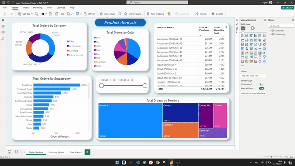
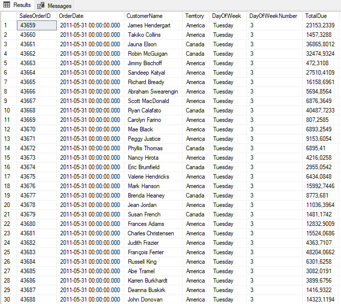
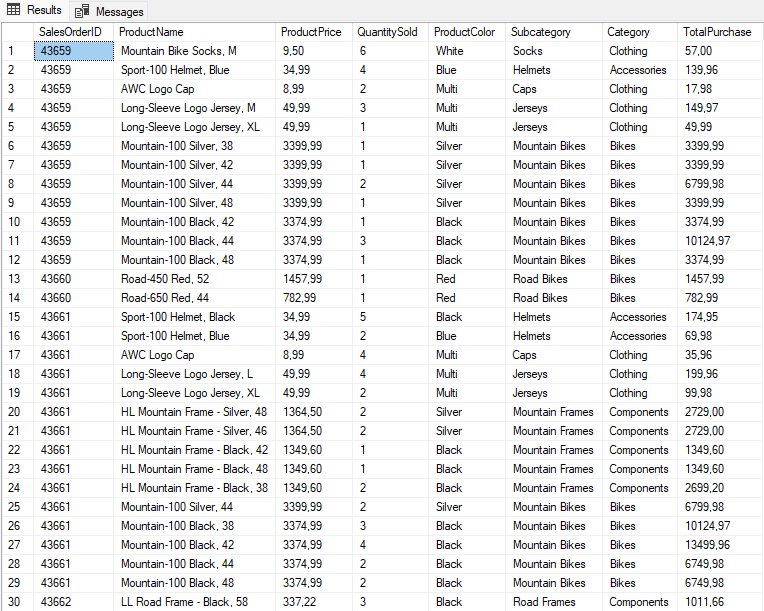

# AdventureWorks2022 analizi

## Nima xaqida?
Najot Ta'limni Data Scince guruhida 3-oy imtihoni kuni ham keldi. Imtihon project'ni ximoya qilishdan iborat bo'lib shu oy SQL va PowerBI larda urgangan narsalarimizni ko'rsatishdan iborat edi. Ma'lumot sifatida bizga ko'pchilik eshitkan AdventureWorks (2022v) database berilgan. Imtihonda 3 kishigacha komanda qilish mumkinligi uchun men guruhdoshim Jahongir aka bilan guruh tuzdik va 5 kun ichida bor bilimimizni ko'rsatishga kirishdik.

## SQL so'rov
SQL so'rov yozish biz uchun katta muammoga aylandi. Uni yozish uchun boshida 1.5 kun ketgan va uni keyinchalik yana ko'p bora uzgartirganmiz. Muammo esa AdventureWorks2022'da edi. Bu juda ham katta va juda ko'p bog'liqlilarga ega database ekan. Bog'liqliklarni urganishimizga anchagina vaqt ketgazdik.
Bizda birinchi "tugatdik" degan xayol 1ta katta table yasaganimizda bo'ldi va bu bizni birinchi katta xatoyimiz edi. Chuqurlashmagan xolda shuni aytishim mumkinki har bir sotuvda bir necha tovarlar bo'lishi mumkin, biz table'da esa qo'shvorganimiz sababli har bir tovar oldidan unga tegishlik bo'lgan va qaytarilishi mumkin emas bo'lgan ma'lumotlar turgandi. Muammo kattaligi sababli uni tez ko'rdik va 2ta alohida table larga ajratdik. Shu joyda to'xtatib dashboard yasagani ketdik (xali SQL'ga ko'p marotaba qaytamiz). Yakuniy versiyasini pastdagi rasimdan ko'rishiz mumkin:

OrderHistory:

OrderDetail:

## PowerBI dashboard
Dashboard aslida qiyin bo'lmagandi, chunki 1 va 3-oylar davomida kichkina va katta analizlar qilganmiz. Lekin PowerBI biz uchun nisbatan yangi texnalogiya bo'lganligi uchun YouTube va Google ni ko'p marotaba bezovta qildik. Albatta muammolar chiqgan paytda PowerBI ni uzida xal qilishga urunardik, lekin uxshamagan paytda noiloj SQL so'rovni uzgartirishga to'g'ri kelardi. Bu bizga juda yoqmasdi, chunki table da barcha ma'lumotlar bir biriga bog'liq va yangi uzgarishlar, ba'zi qilingan diagrammalarni yangittan qilishga olib kelardi.
Oldin aytilganidek imtihon 5 kunga berilgandi. Biz vaqtdan unumli foydalanganligimiz sababli dashboard'ni dizayniga alohida etibor qaratishga ulgurdik.

## Dashboard orqali nimalarni ko'rsatdik?

### Mahsulotlar analizi
Bu qismda mahsulotlarni kategoriyalar va hududlar bo'yicha sotilishi va qaysi mahsulot bizga ko'p daromad olib kelyapti va qaysilari eng ko'p sotilganini ko'rishimiz mumkin.

### Mijozlar analizi
Bu yerda esa eng ko'p xarid qiluvchi va eng daromad olib keluvchi mijozlar hududlar kesimida keltirilgan.

### VAQT bo'yicha analiz
Vaqt bo'yicha analiz qismida eng ko'p daromad va savdolar qaysi yilda va qaysi oyga to'g'ri kelayotgani ko'rsatib berilgan.

## Project'dan olgan foyda
Avvalam bor bu project mening va Jahongir akaning birnchi guruhdagi qilingan project'miz edi. Jamoa bo'lib ishlash aaancha oson ekan. Man ko'p yangiliklar kiritishni va bor narsalarni uzgartirishni yoqtiraman, Jahongir aka esa aksincha stabillik va bor rejaga rioya qilishga moyillar. Uzimni fikrimni yetkazish paytida o'ylagan narsamni uzim ham yaxshiroq tushunvolardim va ba'zida aytib turgan paytimda bemani narsaligini ham anglardim.. Agar uzim qilganimda keraksiz bo'lgan 'eksperiment'larga ko'p vaqtimi zoya ketgazgan bo'lardim. Bundan tashqari albatta ish paytida 2 kishi xato topishi tezroq bo'ladi. Jahongir aka bilan oldindan birga o'qiganligimiz uchun bir birimizi tushunish oson bo'ldi.
Ikkinchi o'rinda foyda bo'lgan narsa bu ish arxitekturasini yanada yaxshiroq tushunvolish bo'ldi. Bu imtihonda qilgan va to'g'irlashga vaqt ketkazgan muammolarni endi kelajakda tez topib yechish mumkin.

Umuman olganda bu imtihon eng qiziqarlik va foydalik bo'ldi. Bu uchun ustozimga va Jahongir akaga ming bora rahmat. Umid qilamanki kelajakda yana birga project'lar qilamiz.

## Mualliflar
- Muhammadjon Mahmudov
- Jahongir Sapayev