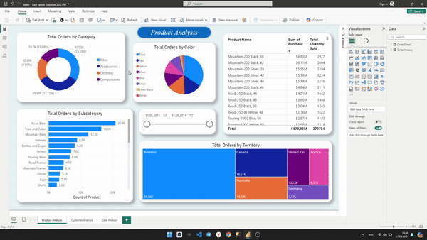

# Анализ AdventureWorks2022

## О чём?
Наконец наступил экзамен третьего месяця курса Data Scince в Najot Ta'lim. В качестве экзамена нам дали задание создать проект используя полученные в этом месяце знания по SQL и PowerBI. В качестве данных нам дале довольно известную датабазу [AdventureWorks](https://learn.microsoft.com/en-us/sql/samples/adventureworks-install-configure?view=sql-server-ver16&tabs=ssms) (2022v). В экзамене можно было создавать команды до 3 человек, поэтому я с Жахонгир объединились и делали проект последующие пять дня.
